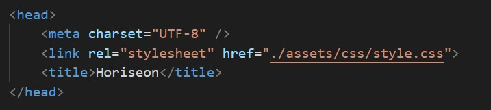
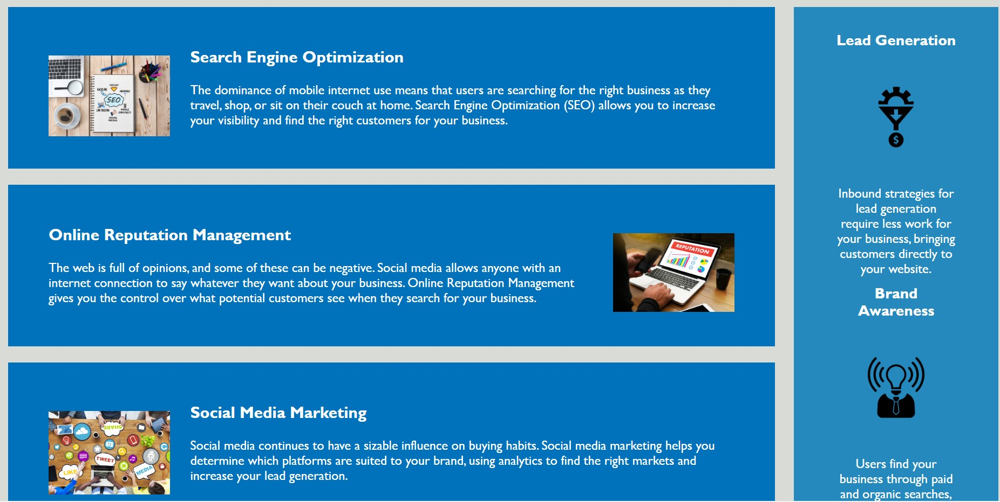
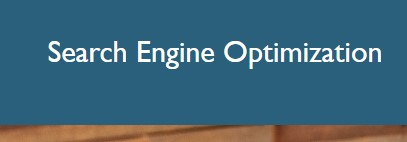
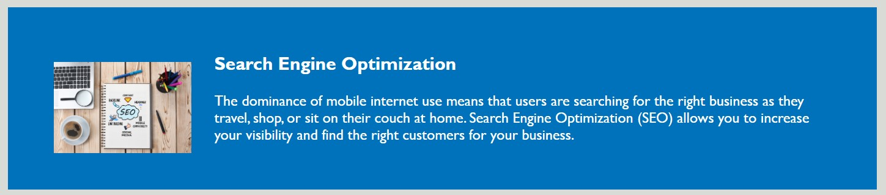
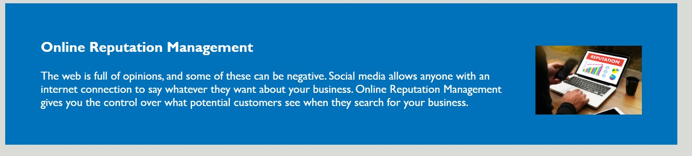
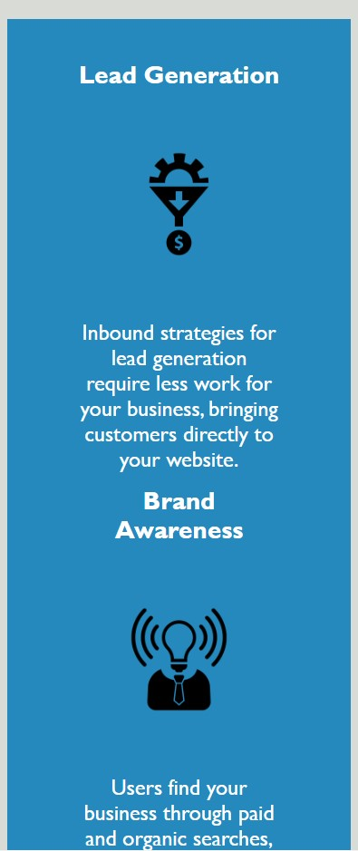

HTML, CSS, and Git

## Challenge 1

The purpose of this challenge as a developer is to know the basics of HTML and CSS.

As a developer, it is our job to take something like this challenge and keep everything as designed. But to change the structure inside html and css to make sure it is following the basic semnatic structure.

This is where the files are linked, from html to css.

This is the main page of the webpage.

As you are in the main page, if you are to click on the "Search Engine Optimization" 

It then will lead you to this following part of the page.

If you are to click on the "Online Reputation Management" 

It then will lead you to this following part of the page.

If you are to click on the "Social Media Marketing" 

It then will lead you to this following part of the page.

On the right side of the web page, there is a column "Lead Generation" have 2 pointers about Brand Awareness and Cost Management.

* A few things were changed in HTML, as adding a few classes to the elements. Changing some of the elements to more of a generic elements. Making sure in the html and css were linked properly.

* Minor change in the CSS: some of the class (.class) that are under one container that have the same padding,margins, etc were moved into 1 place.

